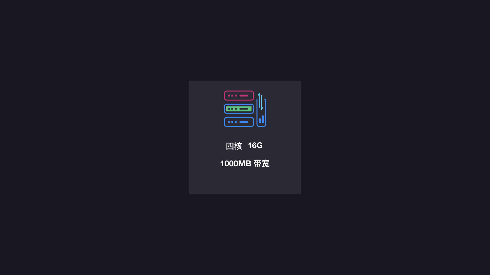
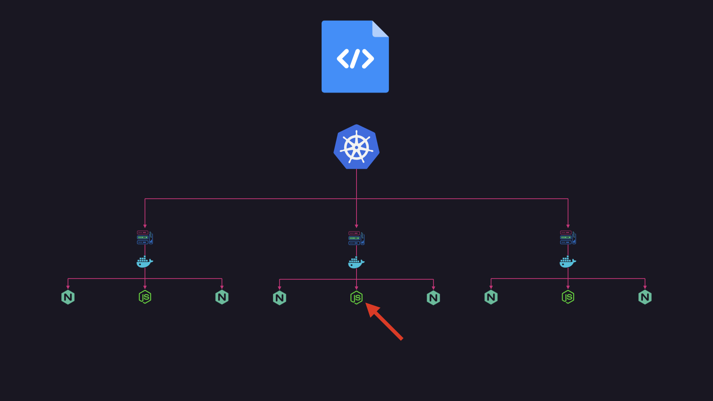
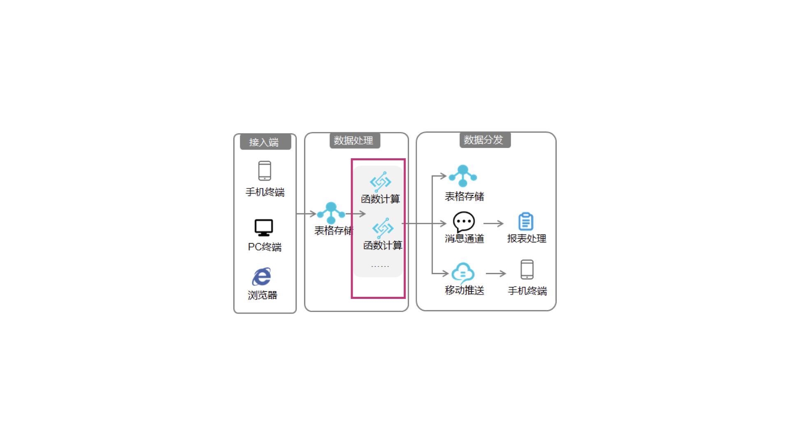
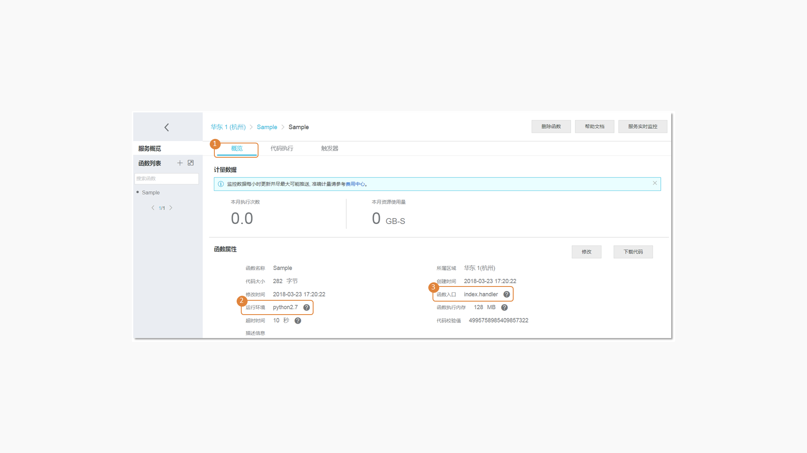
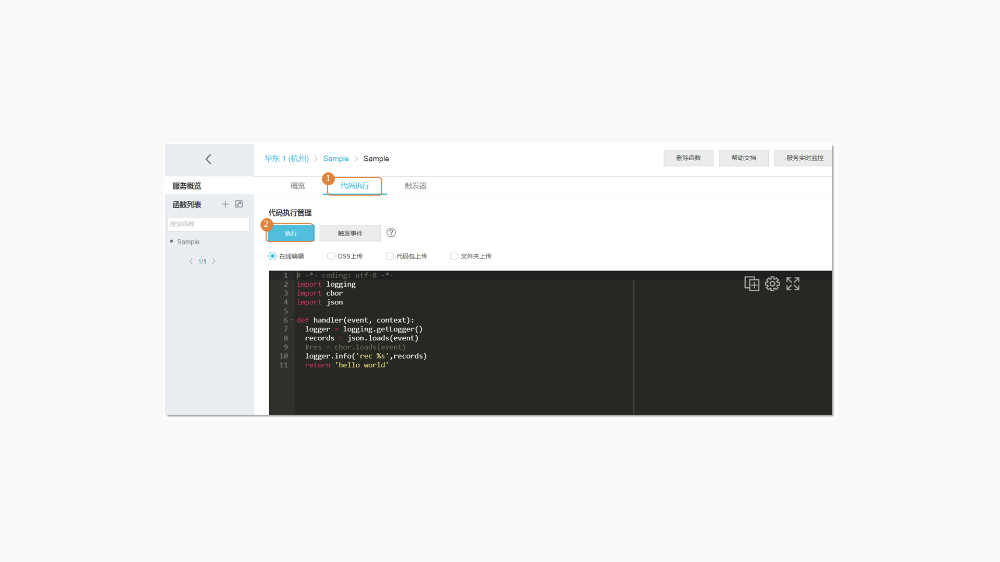
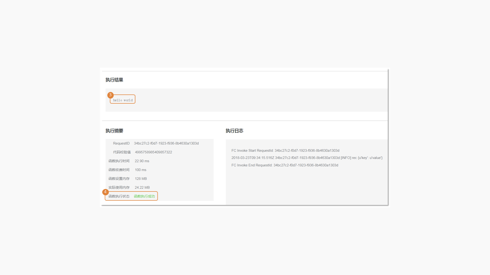

# ServeLess 演讲内容

### 演讲 PPT 在线版

### 学习链接
- [ServeLess 应用场景](https://helpcdn.aliyun.com/document_detail/65565.html)  
- [函数计算](https://www.aliyun.com/product/fc?spm=5176.12825654.eofdhaal5.45.7acc2c4aBYbpy1&aly_as=7T_jDru0)  

### 早报相关
在[每日时报](https://wubaiqing.github.io/zaobao/) 推荐过关于 ServerLess 的一些文章如下：

[文章] Serverless SSR，学习试例：<https://zeit.co/blog/serverless-ssr>
[文章] 花了 1000G，我终于弄清楚了 Serverless 是什么（上）：什么是 Serverless 架构：<https://segmentfault.com/a/1190000012042629>
[文章] 探索 Serverless 中的前端开发模式：<https://juejin.im/post/5cdc3dc2e51d453b6c1d9d3a>
[文章] 《使用 Serverless 为后端服务开发一个有趣的 Chrome 扩展程序》：<https://juejin.im/post/5cf7048b518825064000652e>
[新闻] 阿里巴巴发布 Aliyun Serverless VS Code 插件，轻松开发阿里云函数计算：<https://mp.weixin.qq.com/s/K-ZB-DvZRA9S3OxBQ9PwZw>
[新闻] 阿里云小程序 Serverless 场景落地，已经出了商用方案了：<https://help.aliyun.com/document_detail/123251.html?spm=a2c4g.11186623.6.548.54035db9lYe5BT>
[文章] 阿里云 Serverless 应用场景：<https://help.aliyun.com/document_detail/65565.html>
[工具] Fun 是一个用于支持 Serverless 应用部署的工具，能帮助您便捷地管理函数计算、API 网关、日志服务等资源。它通过一个资源配置文件（template.yml），进行开发、构建、部署操作：<https://github.com/alibaba/funcraft>
[文章] Serverless 架构是指大量依赖第三方服务（也叫做后端即服务，即 “BaaS”）或暂存容器中运行的自定义代码（函数即服务，即“FaaS”）的应用程序，函数是无服务器架构中抽象语言运行时的最小单位。在这种架构中，我们并不看重运行一个函数需要多少 CPU 或 RAM 或任何其他资源，而是更看重运行函数所需的时间，我们也只为这些函数的运行时间付费：<https://github.com/phodal/serverless>
[文章] 作为一个前端，你可能一直在迷茫，Node.js 的定位是什么？为什么我们需要它？尤其是到了 2019 这个时间点，未来一段时间内，有一个词 ServerLess 你会听到想吐：<https://www.yuque.com/egg/nodejs/sff-history>
[工具] Serverless 架构开发框架 Serverless Framework 使用 AWS Lambda、Azure Functions 与 Google CloudFunctions 等技术，可以构建 Serverless 架构的 Web、移动和 IoT 应用。它不仅允许用户自由选择不同的部署目标，而且能帮助更快更轻松地对事件驱动型函数即服务（FaaS）应用进行测试、部署与管理。在创建函数、定义端点并指定目标云环境之后，Serverless Framework 即可对代码、安全性要求、资源要素以及云部署 YAML 进行打包，从而顺利完成项目部署：<https://github.com/serverless/serverless>
[文章] 2019 JSConf China 《面向传统，Serverless 进化之路》分享文字版：<https://zhuanlan.zhihu.com/p/87940654>
[文章] 《Rethink: Serverless For Frontend》我们需要 BFF（Backend For Frontend）带来的能力，但我们不需要 BFF 带来的那些额外的学习成本和运维成本：<https://www.yuque.com/egg/nodejs/sff-slide>
[文章] Serverless Kubernetes 场景和架构剖析：<https://mp.weixin.qq.com/s/WPEX4ETdbue5BrzYODupcw>
[视频] 教你在在 AWS 平台上，使用 ServerLess 服务：<https://frontendmasters.com/courses/serverless-aws/>

